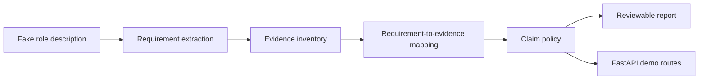

# TraceOps Evidence Demo

TraceOps Evidence Demo is a small Python/FastAPI demo that maps fake engineering evidence to role requirements, classifies each claim by support level, and writes a source-backed evidence report.

## What This Is

This repo shows a reviewable internal-tool pattern using fake demo data only. It ingests markdown evidence, extracts role requirements, maps requirements to sources, applies a claim policy, and writes a markdown report.

## What Problem It Demonstrates

Engineering review notes are often scattered across validation logs, station notes, and automation records. This demo shows how to keep claims tied to source files so reviewers can tell which statements are supported, partial, or unsupported.

## Workflow



## Claim Classification Rules

- Supported: direct source evidence exists and at least one source path is listed.
- Partial: weak or incomplete source evidence exists and at least one source path is listed.
- Unsupported: no source evidence exists. The claim stays visible for review and is not promoted.

## Source Provenance Rules

- Report source paths are repo-relative.
- Paths use forward slashes.
- Supported and partial claims list source files.
- Unsupported claims explicitly state that no source evidence was found.

## Example Decision Table

| Requirement | Decision | Source |
| --- | --- | --- |
| Python automation for validation workflows | Supported | `data/demo_evidence/python_automation_notes.md` |
| Repeatable failure documentation and operator handoff | Partial | `data/demo_evidence/validation_station_notes.md` |
| Production database ownership | Unsupported | No source evidence found |

## How To Run Locally

```powershell
python -m pip install -e ".[test]"
python -m uvicorn app.main:app --reload
```

Useful routes:

- `GET /`
- `GET /health`
- `GET /evidence`
- `GET /report`
- `POST /demo/report`

## How To Run Tests

```powershell
python -m pytest -q
python scripts/check_public_safety.py
python scripts/run_demo.py
python scripts/check_public_safety.py
```

The generated report is written to `outputs/demo_report.md`. A committed example lives at `docs/examples/demo_report_example.md`.

## Public-Data Safety Note

All included data is fake demo data. The safety scanner checks public text files for fake blocked placeholder terms and skips generated output directories.

## Limitations

- Fake data only.
- Deterministic keyword matching only.
- No LLM integration.
- No database.
- No external APIs.
- No claim about live systems.
