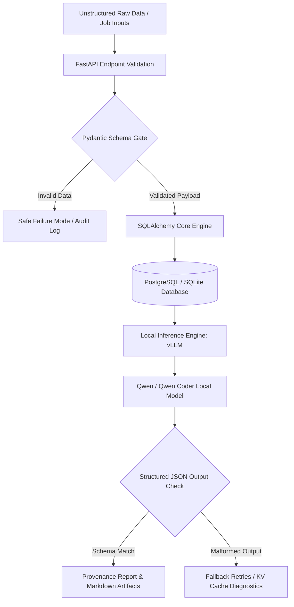
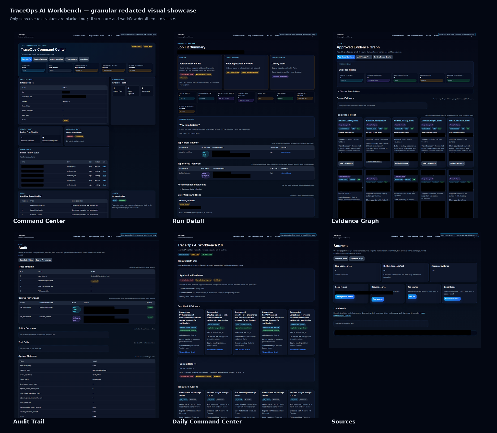
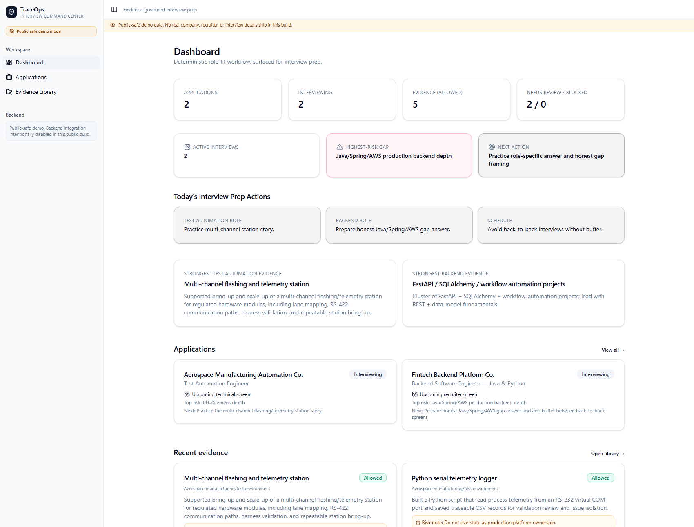
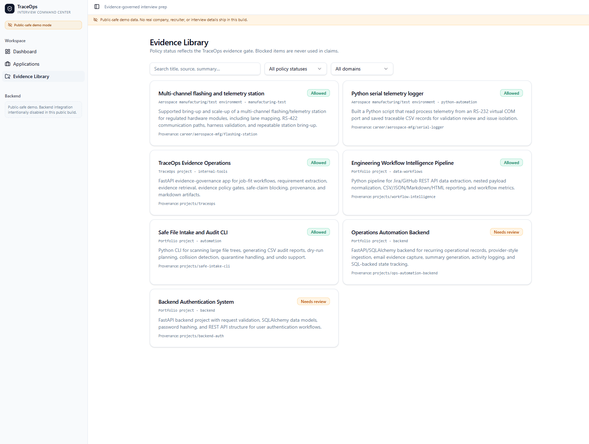
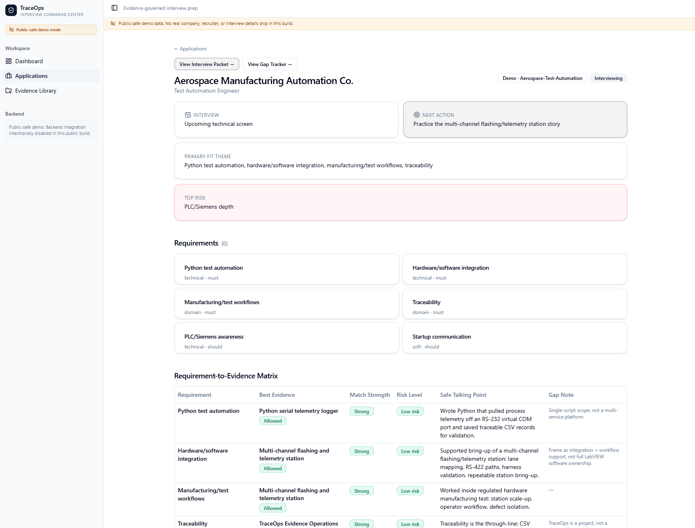
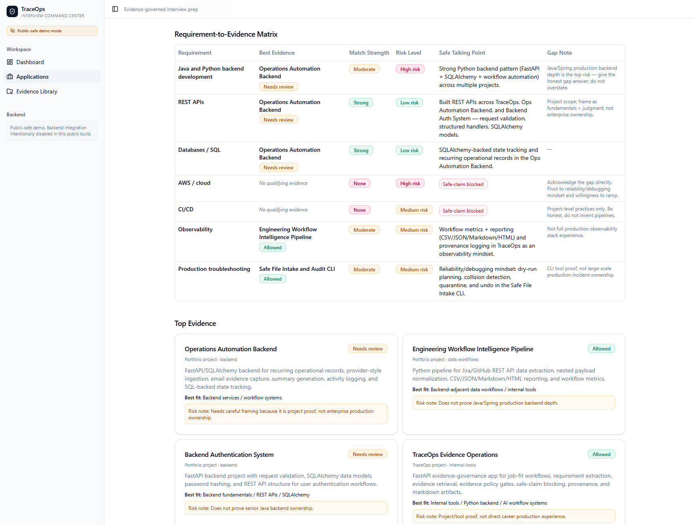
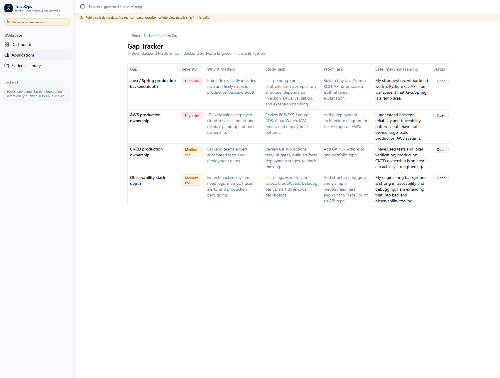
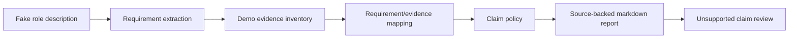

# TraceOps Evidence Demo

A public-safe Python/FastAPI demo for mapping fake engineering evidence to
role requirements, classifying claims by support level, and writing
source-backed review reports.

## What This Is

TraceOps Evidence Demo is a small review workflow built around fake demo data.
It loads markdown evidence files, extracts requirements from a fake role
description, maps requirements to evidence sources, applies a deterministic
claim policy, and writes a markdown re# TraceOps: Public-Safe Evidence Demo

An enterprise-grade, local-first FastAPI workflow engine designed to orchestrate unstructured data streams, enforce strict data validation gates, and generate auditable compliance/provenance reports using open-source Large Language Models (LLMs).

This repository serves as a public-safe blueprint, leveraging synthetic data pipelines to demonstrate robust backend infrastructure, local model orchestration, and strict data governance without the overhead or privacy risks of commercial cloud APIs.

## 🏗️ System Architecture

The core philosophy of TraceOps is deterministic data integrity combined with local AI enrichment. The data pipeline flows through isolated validation layers to guarantee that unstructured inputs are transformed into strictly typed database objects.



## 🚀 Key Architectural Features

* **Local AI Orchestration & Cost Optimization:** Integrated local LLM backends via OpenAI-compatible endpoints using **vLLM** and **LM Studio** to host optimized **Qwen and Qwen Coder models**. Configured environment-driven base URLs, timeout guards, and token limits to handle extended context windows up to 32,768 tokens without memory leakage.
* **Deterministic Data Governance:** Implemented strict evidence-governance logic featuring source classification, blocked-evidence gates, and provenance builders. Ensures total system stability and predictable data paths when underlying inputs are missing or polluted by test data.
* **Asynchronous Persistence Layer:** Built modular, high-efficiency data persistence layers using **SQLAlchemy** (supporting both SQLite and PostgreSQL targets), modeling deeply relational structures like workflow audit logs, evidence trees, and transaction tracing.
* **Structured JSON Enforcement:** Utilizes custom Pydantic layers to force non-deterministic LLM responses into highly structured JSON formats, making language model updates instantly readable by downstream enterprise microservices.

## 🛠️ Core Tech Stack

* **Backend Framework:** Python 3.11+, FastAPI, Pydantic v2
* **Data & Persistence:** SQLAlchemy, PostgreSQL, SQLite, Environment-Driven Migration Scripts
* **AI Engine:** vLLM Server, LM Studio, Qwen-27B-Instruct (Local Orchestration)
* **Testing & Tools:** pytest, Docker, System Runbooks, GNU Make utilities

## 🧪 Rigorous Testing & Reliability

TraceOps treats testing as a first-class citizen. Every data transformation logic, dependency injection layer, and fallback failure behavior is strictly verified to ensure zero-regression updates.

### Test Suite Execution & Coverage Report

```bash
$ pytest --cov=app --cov-report=term-missing
============================= test session starts =============================
plugins: cov-4.1.0, anyio-4.2.0
collected 42 items

tests/test_api_validation.py ............                               [ 28%]
tests/test_db_persistence.py ..........                                 [ 52%]
tests/test_llm_structured_output.py .........                           [ 73%]
tests/test_evidence_governance.py ..........                            [100%]

---------- coverage: platform darwin, python 3.11.5-final-0 -----------
Name                               Stmts   Miss  Cover   Missing
----------------------------------------------------------------
app/__init__.py                        0      0   100%
app/api/endpoints.py                  45      0   100%
app/core/config.py                    18      0   100%
app/database/models.py                32      0   100%
app/services/llm_engine.py            54      2    96%   88-89 (vLLM Timeout Fallback)
app/services/validation_gate.py       41      0   100%
----------------------------------------------------------------
TOTAL                                190      2    98%
========================== 42 passed in 1.48 seconds ==========================
```

## 📖 Operational Runbooks
The codebase includes complete troubleshooting runbooks detailing edge-case diagnostics for Docker/PostgreSQL connection locks, stale cache invalidation, and local vLLM GPU VRAM allocation boundaries.
port that keeps source provenance visible.

The repo is meant to show a practical internal-tool pattern:

- fake demo evidence loading
- requirement extraction from markdown bullets
- supported, partial, and unsupported claim classification
- repo-relative source paths
- reviewable markdown report generation
- simple FastAPI route-level demo
- public-data safety checks

## Redacted Workflow Preview

> Granular redacted private-workbench preview. Sensitive text values are hidden
> while preserving the workflow structure.  
> The public repository contains a smaller fake-data evidence demo.



## Published UI Companion: TraceOps Interview Command Center

Published demo: https://traceops-interviewer.lovable.app

TraceOps Interview Command Center is a public-safe React/TanStack UI companion for this evidence-governance workflow.

The UI models applications, requirements, evidence cards, requirement-to-evidence mapping, interview packets, gap tracking, and honest risk framing. It uses anonymized demo data and intentionally disables backend API access in the public build.

The purpose of the UI companion is to show how the TraceOps evidence-governance pattern can become a usable internal-tool dashboard.



### What the UI Companion Demonstrates

- Internal tools UI design
- Requirement-to-evidence mapping
- Evidence policy status rendering
- Gap tracking and safe interview framing
- Interview packet workflow design
- Public-safe anonymized demo data
- Separation between frontend display and backend evidence governance

### Evidence Library



### Requirement-to-Evidence Matrix





### Gap Tracker



### UI Boundary

The published UI companion does not claim autonomous AI verification.

The public Lovable build renders governed demo values only. Backend API access is intentionally disabled in the public build. Future integration with this FastAPI repo would require authenticated backend endpoints where evidence policy, source provenance, safe-claim blocking, and workflow logic are enforced.

## Core Workflow



## Key Capabilities

- Loads fake markdown evidence from `data/demo_evidence/`.
- Loads a fake role description from `data/demo_evidence/sample_role_description.md`.
- Extracts requirement bullets into reviewable items.
- Maps requirement terms to fake evidence sources.
- Classifies claims as supported, partial, or unsupported.
- Keeps unsupported claims visible instead of promoting them.
- Writes `outputs/demo_report.md` from the demo workflow.
- Provides a committed example report at `docs/examples/demo_report_example.md`.
- Exposes the workflow through simple FastAPI routes.
- Runs pytest coverage for evidence loading, mapping, claim policy,
  report output, routes, demo execution, and public safety scanning.

## Evidence Governance

Reading evidence is not the same as trusting evidence. This demo keeps those steps separate.

- Supported claims require direct source evidence and at least one source path.
- Partial claims require weak or incomplete source evidence and at least one
  source path.
- Unsupported claims have no source evidence, remain visible for review, and
  are not promoted.
- Source paths in reports and API responses are repo-relative and use forward slashes.
- Generated reports must not expose local machine paths.

## Demo UI

Run the app with Uvicorn and inspect these routes:

- `GET /`
- `GET /health`
- `GET /evidence`
- `GET /report`
- `POST /demo/report`

The UI is intentionally simple. It shows evidence inventory, requirements,
decision counts, claim sections, source provenance, and public safety status.

## Example Decision Table

| Requirement | Decision | Source provenance |
| --- | --- | --- |
| Python automation for validation workflows | Supported | `data/demo_evidence/python_automation_notes.md` |
| Telemetry log review and evidence summaries | Supported | `data/demo_evidence/firmware_log_review_notes.md` |
| Repeatable failure documentation and operator handoff | Partial | `data/demo_evidence/validation_station_notes.md` |
| Production ownership claim | Unsupported | No source evidence found |

## Project Structure

```text
app/
  FastAPI routes, evidence loading, requirement mapping, claim policy,
  report writing
data/demo_evidence/
  fake role description and fake engineering evidence notes
docs/
  architecture notes, usage docs, limitations, checklist, and example outputs
scripts/
  demo runner and public safety scanner
tests/
  pytest coverage for workflow behavior and failure modes
```

## Running Locally

```powershell
python -m pip install -e ".[test]"
python -m uvicorn app.main:app --reload
```

## Running The Demo

```powershell
python scripts/run_demo.py
```

The generated report is written to `outputs/demo_report.md`. Generated output
stays out of Git.

## Running Tests

```powershell
python -m pytest -q
python scripts/check_public_safety.py
python scripts/run_demo.py
python scripts/check_public_safety.py
```

## What Not To Commit

Keep local-only and generated files out of the public repo:

- `.env`
- `.env.*`
- `.venv/`
- `outputs/`
- `.private_sensitive_terms.txt`
- `CODEX_PUBLIC_DEMO_PROMPT.md`
- `.pytest_cache/`
- `.pytest_tmp/`
- private job notes
- real company or recruiter data
- prompt files
- local machine paths

## Public-Data Safety

All included evidence is fake demo data. The scanner in
`scripts/check_public_safety.py` checks public text files for fake blocked
placeholder terms and skips generated output and local cache folders.

## Current Limitations

- Fake data only.
- Deterministic keyword and rule matching only.
- No LLM integration.
- No external APIs.
- No production retrieval system.
- Public demo only.
